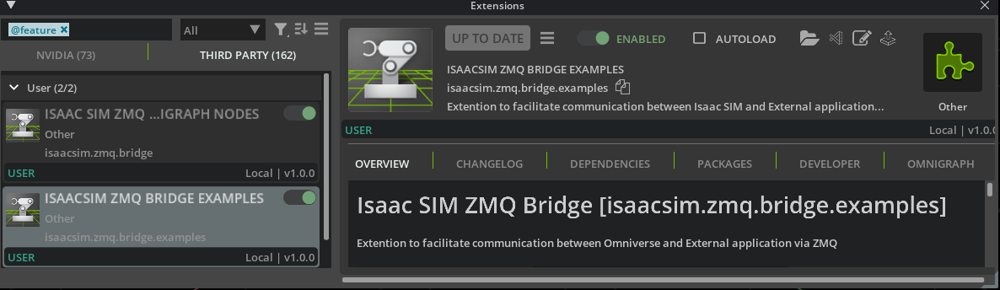
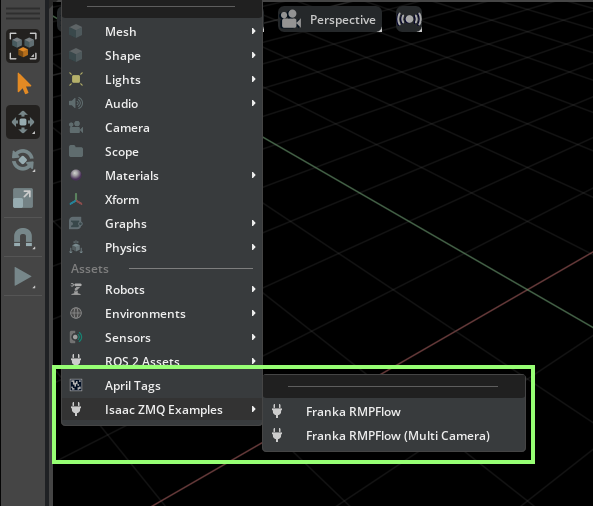
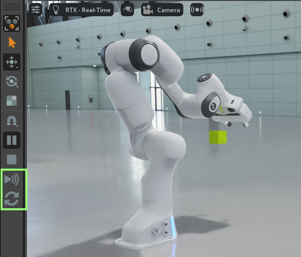

# Isaac Sim ZMQ Bridge

[](https://docs.isaacsim.omniverse.nvidia.com/latest/index.html)
[](https://releases.ubuntu.com/20.04/)
[](https://opensource.org/licenses/MIT)

A reference bridge implementation for bidirectional communication between NVIDIA Isaac Sim and external applications using [ZeroMQ](https://zeromq.org/) and [Protobuf](https://protobuf.dev/).


## Table of Contents

- [Overview](#overview)
- [Features](#features)
- [Requirements](#requirements)
- [Installation](#installation)
- [Usage](#usage)
  - [Client (Isaac Sim)](#client-isaac-sim)
  - [Server (Python)](#server-python)
  - [Examples](#examples)
- [Headless / Python Standalone Mode](#headless--python-standalone-mode)
- [Architecture](#architecture)
  - [Client Implementation](#client-implementation)
  - [Server Implementation](#server-implementation)
  - [Serialization](#serialization)
- [Development](#development)
- [Troubleshooting](#troubleshooting)
- [License](#license)

## Overview

[Isaac Sim](https://developer.nvidia.com/isaac/sim) is the most advanced simulator for vision-based systems and robots. It has great built-in support for ROS communication of sensors data, but not everyone is using ROS.

This bridge enables:
- Simple and performant bidirectional communication between Isaac Sim and external applications
- A foundation for Software-in-the-Loop (SIL) testing of vision models and behavior logic
- A pathway to Hardware-in-the-Loop (HIL) testing when converted to run on edge devices

The implementation uses:
- [ØMQ](https://zeromq.org/) for high-performance messaging
- [Protobuf](https://protobuf.dev/) for efficient data serialization

The provided examples demonstrate:
- Streaming of camera data (RGB, depth)
- Transfer of bounding box detections (Ground Truth)
- Robot control commands
- Auxiliary data exchange


## Requirements

- Linux Ubuntu 22.04
- [NVIDIA Isaac SIM Requirements](https://docs.isaacsim.omniverse.nvidia.com/latest/installation/requirements.html)
- [Isaac SIM >4.5.0 (Workstation or Container)](https://docs.isaacsim.omniverse.nvidia.com/latest/installation/install_workstation.html)
- Docker
- [NVIDIA Container Toolkit](https://docs.nvidia.com/datacenter/cloud-native/container-toolkit/latest/index.html)

## Installation

1. Clone this repository & build:
```bash
git clone https://github.com/isaac-sim/IsaacSimZMQ.git
cd IsaacSimZMQ
./build.sh
```


> **Note**: Build is required even for the [Python-only mode](#python-only-mode).

<details>
<summary><b>Isaac Sim Container</b></summary>

To use the extension in an Isaac Sim container, follow these steps:

1. Pull the [Isaac Sim container](https://docs.isaacsim.omniverse.nvidia.com/latest/installation/install_container.html#):
```bash
docker pull nvcr.io/nvidia/isaac-sim:4.5.0
```

2. From this repo root, run the container + mount the extension and assets:
```bash
docker run --name isaac-sim --entrypoint bash -it --runtime=nvidia --gpus all -e "ACCEPT_EULA=Y" --rm --network=host \
    -e "PRIVACY_CONSENT=Y" \
    -v ~/docker/isaac-sim/cache/kit:/isaac-sim/kit/cache:rw \
    -v ~/docker/isaac-sim/cache/ov:/root/.cache/ov:rw \
    -v ~/docker/isaac-sim/cache/pip:/root/.cache/pip:rw \
    -v ~/docker/isaac-sim/cache/glcache:/root/.cache/nvidia/GLCache:rw \
    -v ~/docker/isaac-sim/cache/computecache:/root/.nv/ComputeCache:rw \
    -v ~/docker/isaac-sim/logs:/root/.nvidia-omniverse/logs:rw \
    -v ~/docker/isaac-sim/data:/root/.local/share/ov/data:rw \
    -v ~/docker/isaac-sim/documents:/root/Documents:rw \
    -v $(pwd)/exts:/root/Documents/exts:rw \
    -v $(pwd)/assets:/root/Documents/assets:rw \
    nvcr.io/nvidia/isaac-sim:4.5.0
```
3. __Inisde the container__, install the dependencies:
```bash
apt-get update
apt-get install -y libunwind8
```
4. Now you can continue to the [Usage](#usage) section to run the extension.

</details>


## Usage

### Client (Isaac Sim)



1. Launch Isaac Sim
2. Open **Window -> Extensions** from the top menu
3. In the Extensions manager window, open settings (hamburger button near search field)
4. Click the "+" button and add the path to your cloned repo + `/exts`
5. Enable the `ISAAC SIM ZMQ BRIDGE EXAMPLES` extension in the Third-Party tab.
6. Open an example from **Main menu > Create > Isaac ZMQ Examples**

> **Note**: First load of the extension may fail due to missing imports. This should be resolved after restarting Isaac Sim.



### Server (Python)

The server is a Python application running inside a Docker container. It provides a starting point for building your own server to communicate with Isaac Sim, where you can run and test your CV models or any other task that will form a closed loop with Isaac Sim.

1. Build the Docker image and run it:
```bash
cd isaac-zmq-server
./build_server.sh
./run_server.sh
```

2. Inside the container, run the server:
```bash
python example.py
```

3. For the [Franka RMPFlow (Multi Camera)](#examples), start two servers:
```bash
# Inside the first container
python example.py # server 1 for main camera

# In a second container
python example.py --subscribe_only 1 --port 5591 # server 2 for gripper camera
```


Refer to the [Isaac Sim Container Installation Guide](https://docs.isaacsim.omniverse.nvidia.com/latest/installation/install_container.html#) for more information.


### Examples

The repository includes the following example missions:

- **Franka RMPFlow**: Franka arm grabs a cube based on its 3D position, computed using depth + bounding box inside the server
- **Franka RMPFlow (Multi Camera)**: Franka mission with additional camera mounted on gripper

> **Note**: The first time you load an example, expect a few minutes of loading time. During this time, Isaac Sim will hang.

To start communication:
1. In Isaac Sim, click the `Reset World` button on the toolbar
2. Click the `Start Streaming` button



On the server side:
- Use arrow keys + mousewheel to control the camera view / focal length
- Use the Ground Truth combobox to toggle between RGB / BBox2d / Depth visualization

## Headless / Python Standalone Mode

The bridge can work in [standalone](https://docs.isaacsim.omniverse.nvidia.com/latest/python_scripting/manual_standalone_python.html) mode for CI/CD, automation, and higher performance:

```bash
export ISAACSIM_PYTHON=<your isaac sim install path>/python.sh

# from this repo root
$ISAACSIM_PYTHON exts/isaac_zmq_bridge/isaacsim/zmq/bridge/examples/example_headless.py --ext-folder ./exts
```

To change the example in headless mode, edit:
```python
# In exts/isaac_zmq_bridge/isaacsim/zmq/bridge/examples/example_headless.py
# select an example mission here
mission = FrankaVisionMission()
# mission = FrankaMultiVisionMission()
```

## Architecture

The system follows a client-server architecture with specialized components on each side:


### Client Implementation

The client side runs within Isaac Sim and consists of both Python and C++ components for data streaming and command handling.

#### Python Components

- **[ZMQClient](exts/isaac_zmq_bridge/isaacsim/zmq/bridge/examples/core/client.py)**: Manages ZMQ sockets for bidirectional communication with the server
- **[ZMQAnnotator](exts/isaac_zmq_bridge/isaacsim/zmq/bridge/examples/core/annotators.py)**: Configures Camera streaming
- **[Mission](exts/isaac_zmq_bridge/isaacsim/zmq/bridge/examples/mission.py)**: Base class for the examples, handles world management and communication

#### C++ Components

- **[OgnIsaacBridgeZMQNode](exts/isaacsim.zmq.bridge/plugins/nodes/OgnIsaacBridgeZMQNode.cpp)**: OmniGraph node that streams camera data, bounding boxes, and timing information
- **[OgnIsaacBridgeZMQCamera](exts/isaacsim.zmq.bridge/plugins/nodes/OgnIsaacBridgeZMQCamera.cpp)**: Computes and provides camera parameters for streaming

The client supports both high-performance C++ mode (using OmniGraph nodes) and a simpler Python-only mode.

### Server Implementation

The server side runs as a Dockerized Python application that processes data from Isaac Sim.

- **[ZMQServer](isaac-zmq-server/src/isaac_zmq_server/server.py)**: Manages ZMQ socket connections and message handling
- **[App](isaac-zmq-server/src/isaac_zmq_server/ui.py)**: Base class for the GUI application using DearPyGUI
- **[FrankaVisionMission](isaac-zmq-server/src/example.py)**: Example that processes camera data and generates robot commands
- **[CameraToWorldSpaceTransform](isaac-zmq-server/src/isaac_zmq_server/cv.py)**: Utility for 3D position calculation from 2D detections

### Serialization

Protobuf is used for serialization of all messages between Isaac Sim and the server:
- [client_stream_message.proto](/proto/client_stream_message.proto): Defines messages from client to server
- [server_control_message.proto](/proto/server_control_message.proto): Defines messages from server to client

## Python-Only Mode

To enable Python-only mode, modify the mission initialization:

```python
# In exts/isaac_zmq_bridge/isaacsim/zmq/bridge/examples/example_missions.py
class FrankaVisionMission(Mission):
    def __init__(self,...):
        ...
        self.use_ogn_nodes = False  # Set to False for Python-only mode
```

The key difference between modes:
- **C++ Mode**: Acquires sensor data directly as CUDA pointers, providing a pathway for high-performance processing before streaming when working with multiple sensors or high-resolution data
- **Python Mode**: Simpler implementation without direct CUDA access, suitable for prototyping but with performance limitations for complex sensor configurations

> **Note**: The camera message processing happens in different places depending on the mode: in Python-only mode, it occurs in the [`ZMQAnnotator.stream()`](exts/isaac_zmq_bridge/isaacsim/zmq/bridge/examples/core/annotators.py#L250) method, while in C++ mode, it's handled during the [`OgnIsaacBridgeZMQNode::compute()`](exts/isaacsim.zmq.bridge/plugins/nodes/OgnIsaacBridgeZMQNode.cpp#L115) execution.

## Development

After running the basic examples, try to extend the functionality by:

1. Implementing custom message types in the Protobuf definitions
2. Adding new mission types for different robot configurations
3. Integrating your own vision models in the server container
4. Adding support for additional data types like point clouds or joint states


## Troubleshooting

<details>
<summary>Docker example app not starting</summary>

When running the example app inside the docker container, you may encounter the following error, it is harmless and can be ignored.

```bash
X Error of failed request:  BadValue (integer parameter out of range for operation)
  Major opcode of failed request:  130 (MIT-SHM)
  Minor opcode of failed request:  3 (X_ShmPutImage)
  Value in failed request:  0x300
  Serial number of failed request:  135
  Current serial number in output stream:  136
```

</details>


## License

This project is licensed under the [MIT License](/LICENSE.txt).

This project will download and install additional third-party open source software projects. Review the license terms of these open source projects before use.
